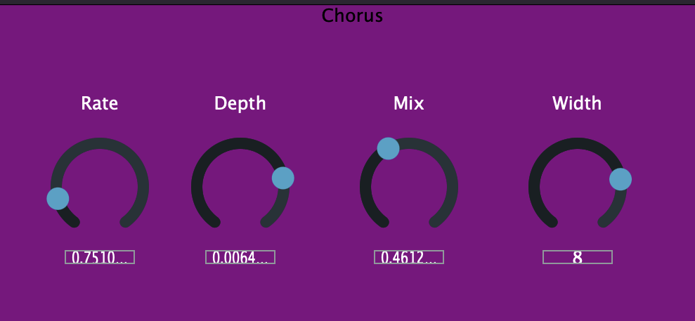

# Chorus Plugin

## Overview

- Stereo chorus built with JUCE. 
- Implemeneted a custom Chorus and DelayLine class independent of the JUCE Framework DSP.
- Inspired by classic BBD chorus pedals. 
- Lowpass filtering to simulate BBD reconstruction using Biquad filter. 
- Stereo width controls that adjust the phase offset of the right and left channels. 

### Built With

JUCE v8.0.7

## Usage

For more examples, please refer to the [Documentation](https://github.com/aejaudio/chorusPlugin1/tree/main/Chorus%20Documents)

## Features
- 6 voices, 3 for each channel 
- Stereo width control
- Custom delay line
- Adjustable rate, depth, mix, and width parameters

## Specifications
- Supported platforms: Mac OS
- Supported formats: AU
- C++17

## Project Status
- Functional and in active development